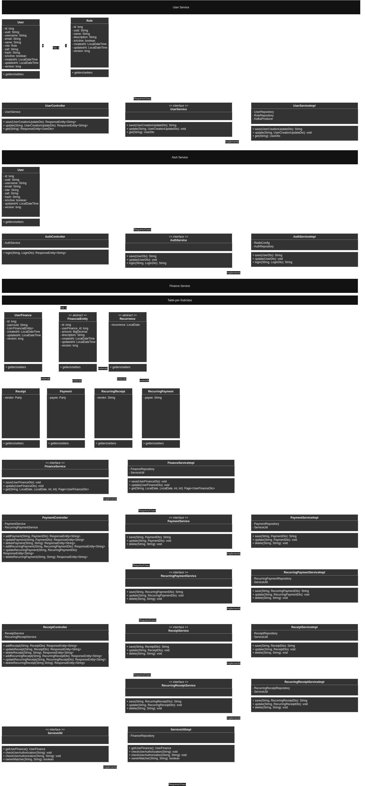

**João Carlos Roveda Ostrovski** 
**System name**: OV-FMA \- Ostro Veda Finance Management Application (Aplicação de Gerenciamento Financeiro)  
**Versão**: *

 Project description
Financial management; income, expenditure, tracking; financial budget and investment registration.  
Services are used and deployed in four modules:

1. **Gateway**: all requests need to be directed to the gateway for proper authorization; services will deny access otherwise.
2. **User**: registration, user data querying and updates (new password, email, username, etc.),
3. **Authentication**: user authentication;
4. **Finance**: Finance Manager API for registering, querying and updating financial information;
    1. Requires a registered and authenticated user (JWT).

### Diagram
